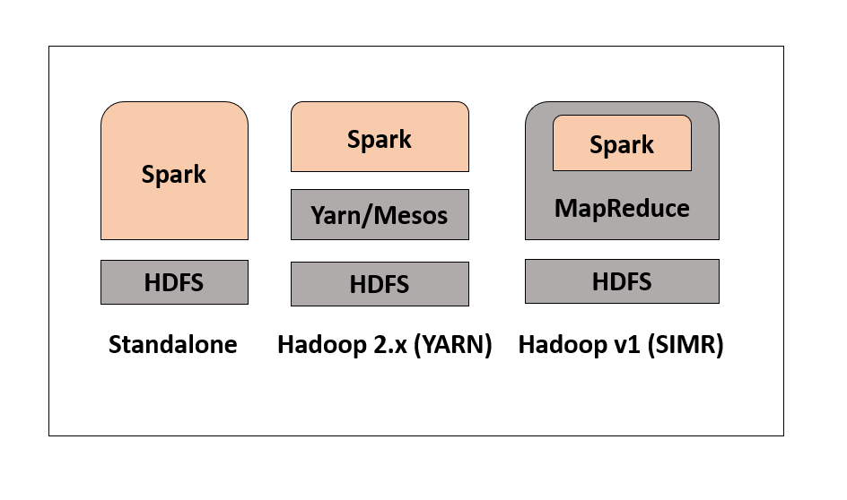

# Spark Scala 00X - Introduction

### Contributors:
Gabriel Klein
{ Reviewers }

## Prerequisites

Hadoop

# How to Complete

Lecture on the introduction to Spark. Content is below:

## History of Apache Spark

- The Spark was started by Matei Zaharia at UC Berkeley's AMP Lab in 2009. it absolutely was open sourced in 2010 under a BSD license.

In 2013, the project was acquired by Apache Software Foundation. In 2014, Spark emerged as a top-level Apache Project.

## What is Spark?

- Apache Spark is a lightning-fast cluster computing technology, it's designed for fast computation.
Spark isn't a changed version of Hadoop. It is based on Hadoop MapReduce and extends the MapReduce model to efficiently use it for more computations, including interactive queries and stream processing.

- The main feature of Spark is its in-memory cluster computing which increases the processing speed of an application, Lazy evaluation.

## Why Spark?

- The reason is that Hadoop framework is based on an easy programming model (MapReduce).
  
- Here, the main concern is to keep up speed in processing large datasets in terms of waiting time between queries and waiting time to run the program.
  
- **Speed** − Spark helps to run an associate application in a Hadoop cluster, up to a hundred times quicker in memory, and ten times faster when running on disk. This is often possible by reducing the number of reading/write operations to disk. It stores the intermediate process data in memory.
  
- **Supports multiple languages** − Spark provides built-in Apis in Java, Scala, or Python. Therefore, you'll be able to write applications in different languages.
  
- **Advanced Analytics** − It supports SQL queries, Streaming data, Machine learning (ML), and Graph algorithms.

## Features of Apache Spark

- Speed
- Reusability
- In Memory Computing
- Advance analytics
- Real time stream Processing
- Lazy evaluation
- Dynamic in Nature
- Fault tolerence

## Spark Built on Hadoop

 

 

There are 3 ways of Spark deployment as explained below:

**Standalone** − Spark Standalone deployment means Spark occupies the place on top of HDFS(Hadoop Distributed File System) and space is allocated for HDFS, explicitly. Here, Spark and MapReduce will run side by side to cover all spark jobs on the cluster.

**Hadoop Yarn** − Hadoop Yarn deployment means, simply, spark runs on Yarn without any pre-installation or root access required. It helps to integrate Spark into the Hadoop ecosystem or Hadoop stack. It allows alternative components to run on top of the stack.

**Spark in MapReduce (SIMR)** − Spark in MapReduce is used to launch spark job addition to standalone deployment. With SIMR, the user can start Spark and uses its shell without any administrative access.

## Apache spark applications

- Machine Learning
  - Apache Spark is provided with a scalable Machine Learning Library called MLlib that can perform advanced analytics like cluster, classification, dimensionality reduction.
- Fog computing
- Event detection
  - The feature of Spark Streaming permits organizations to keep track of rare and unusual behaviors for protecting the systems. institutions, like financial, security, and health organizations, use triggers to allow potential risks.
- Interactive analysis
- Conviva
  - This is the top video company, Conviva deploys Spark for optimizing videos and handling live traffic.

