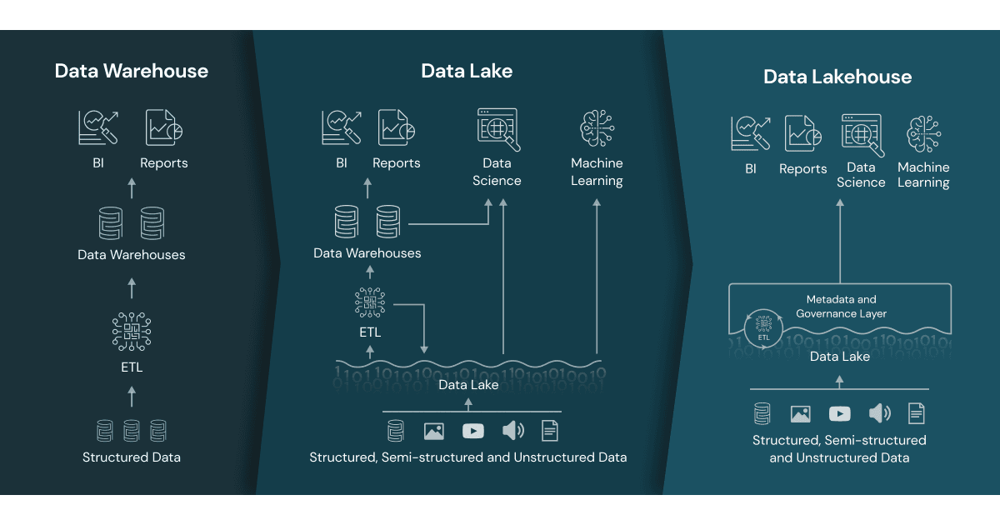

# Databricks Training Notes

## Lakehouse Architecture

### What is a Lakehouse?
A **Lakehouse** is a unified data platform that combines the flexibility and low cost of a **data lake** with the performance and structure of a **data warehouse**.

It allows organizations to:
- Store all types of data (structured, semi-structured, unstructured)
- Run BI, machine learning, and streaming workloads from the same platform
- Avoid maintaining separate data lakes and warehouses



### Lakehouse vs. Data Lake vs. Data Warehouse

| Feature               | Data Lake              | Data Warehouse           | Lakehouse                   |
|----------------------|------------------------|--------------------------|-----------------------------|
| Storage Format       | Raw files (Parquet, CSV) | Optimized columnar tables | Delta Lake (Parquet + ACID) |
| Schema Enforcement   | Optional               | Strict                   | Strict                      |
| Transactions         | No                     | Yes                      | Yes                         |
| Cost Efficiency      | High                   | Medium/Low               | High                        |
| Use Cases            | ML, raw ingestion      | BI, analytics            | All of the above            |
| Governance           | Limited                | Strong                   | Strong (via Unity Catalog)  |

### Why Use a Lakehouse?
- Reduce data silos
- Maintain one source of truth
- Enable advanced analytics and AI with governed data

---

## Delta Lake

Delta Lake is the **core storage layer for the Lakehouse** in Databricks. It brings **ACID transaction support**, **versioning**, and **schema enforcement** to your data lake. Delta Lake is open source software that extends Parquet data files with a file-based transaction log for ACID transactions and scalable metadata handling.

### Key Features
- **ACID transactions**: Prevents dirty reads and partial writes
- **Time travel**: Query historical versions of your data
- **Schema evolution**: Supports changing table schema over time
- **Upserts/Merge support**: Use `MERGE INTO` for CDC and upserts
- **Data compaction**: Optimize small files for performance


---

## Clusters in Databricks

Clusters are the compute environments where your notebooks, jobs, and SQL queries run.

### Cluster Types

| Type               | Description                                        | Best For                         |
|--------------------|----------------------------------------------------|----------------------------------|
| **All-purpose**    | Interactive, shared use                            | Notebooks, ad hoc work           |
| **Job cluster**    | Starts with a job and terminates after             | Scheduled workflows              |


### Key Settings to Know
- **Worker/driver types**: VM size
- **Autoscaling**: Dynamically adjusts based on workload
- **Auto-termination**: Saves cost when idle

---

## Databricks FileStore

FileStore is a user-accessible storage area in **DBFS** (Databricks File System).

### Usage
- Great for uploading local CSV files for quick access
- Files uploaded via UI are stored here by default
- Accessible via `/FileStore/tables/filename.csv`


### Considerations
- Not secure for sensitive or production data
- Use **volumes** (Unity Catalog) or external mounts for production workloads

---

## Catalogs in Unity Catalog

### What is a Catalog?
A **catalog** is the top-level container in the Unity Catalog hierarchy:

```
Catalog → Schema (Database) → Table / View / Volume
```

It allows multi-tenant governance and access control.

### Unity Catalog Benefits
- Centralized access control (via `GRANT`, `REVOKE`)
- Data lineage and audit logs
- Fine-grained access control (row/column level)
- Secure volume and table management

### Example:
```sql
SELECT * FROM main.sales_data.customers;
```

Here:
- `main` = catalog
- `sales_data` = schema
- `customers` = table

---

## Hive Metastore

Before Unity Catalog, Databricks used the **Hive Metastore** as its metadata store.

### Hive Metastore vs. Unity Catalog

| Feature               | Hive Metastore     | Unity Catalog        |
|-----------------------|--------------------|----------------------|
| Governance            | Workspace-scoped   | Centralized (multi-workspace) |
| Volumes Support       | No                 | Yes               |
| Row/Column Security   | No                 | Yes               |
| Catalog/Schema Support| Flat (default DB)  | Multi-level          |
| Auditability          | Limited            | Full lineage & logging |


### Considerations
- You can still use Hive Metastore for legacy support
- But new deployments should use Unity Catalog for governance

---

## Databricks SQL

Databricks SQL is a **dedicated SQL interface** for querying data, building dashboards, and supporting BI workloads.

### Features
- Built-in SQL Editor
- Dashboards with saved queries
- Visual query builder
- Access to Unity Catalog tables
- Works with serverless or classic SQL Warehouses

### Example Queries
```sql
-- Find top 5 vendors by trip count
SELECT vendor_id, COUNT(*) as trip_count
FROM samples.nyctaxi.trips
GROUP BY vendor_id
ORDER BY trip_count DESC
LIMIT 5;
```

### SQL Warehouse Types
| Type       | Description                      |
|------------|----------------------------------|
| Serverless | Auto-managed, instant startup    |
| Classic    | Manually configured              |
| Photon     | High-performance analytics engine|

---


