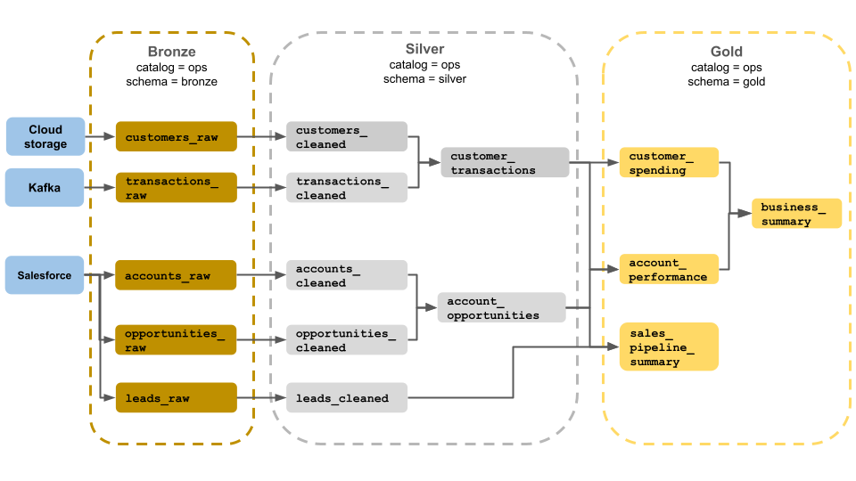

# Medallion Architecture Notes

## Objective  
Provide a clear, structured overview of the Medallion Architecture pattern for organizing data in a lakehouse. Understand the progression from raw ingestion to business-ready tables and the purpose of each layer.

---

## Medallion Architecture  
A **Medallion Architecture** is a data design pattern used to **logically organize data in a lakehouse**, with the goal of **incrementally and progressively improving the structure and quality of data** as it flows through layers—from **Bronze → Silver → Gold**. This approach is also known as a “multi‑hop” architecture 

It supports **ELT workflows**, favoring minimal transformation during ingestion and more complex logic applied in downstream layers. The ultimate purpose is to create **analytics-ready, business‑specific data products** stored in the Gold layer for consumption by BI tools, ML models, or executives 

---

## Bronze Layer  
- **Purpose:** Acts as the **landing zone** for raw or minimally processed data. Raw data represents the initial ingestion stage—data as it exists at the source system. It may be semi‑structured or unstructured (CSV, JSON, logs, etc.), and it typically includes **metadata** like timestamps, file origin, etc. This layer preserves **full history** and retains data in append-only form, enabling reprocessing and lineage tracking 

- **Characteristics:**  
  - Data is ingested as-is, with no or minimal cleaning or validation.  
  - Append-only storage with no deletions or modifications.  
  - Maintains full fidelity of the source for audit, traceability, and reprocessing needs 
- **Who uses it:** Data engineers, data operations teams, compliance and audit teams who need access to unaltered data 

---

## Silver Layer  
- **Purpose:** Refines the Bronze data via cleansing, deduplication, schema enforcement, and integration.
- **Characteristics:**  
  - Data is cleaned (e.g. remove nulls, cast types).  
  - Structural consistency introduced via schema (e.g. templated columns).  
  - Datasets may be joined/merged to create canonical views (e.g. customer, transactions) 
- **Who uses it:**  
  - Data engineers and analysts for deeper analytics.  
  - Data scientists for building predictive models. The Silver layer retains detail needed for advanced analysis 

---

## Gold Layer  
- **Purpose:** Stores **curated, analytics‑ready** data tailored for specific business use cases.
- **Characteristics:**  
  - Data is aggregated, denormalized, and optimized for query performance.  
  - Often organized as tables for reporting (e.g. customer spending, account performance)
  - Final transformation and data quality enforcement occurs here.
- **Who uses it:**  
  - Business analysts, BI developers for dashboards.  
  - ML engineers and executives—this layer supports decision-making and operational reporting 

---

## Summary  
- Medallion Architecture structures data into three logical **quality layers**: **Bronze** (raw), **Silver** (validated), **Gold** (curated).  
- It enables an **incremental improvement in data quality**, traceability, and usability as data flows through each stage.  
- Preferred in **ELT-first lakehouse environments**, allowing rapid ingestion and flexible transformation.  
- Empowers different personas (engineers, analysts, data scientists, business users) by exposing data that’s suited to their needs.  
- Helps maintain ACID compliance, time travel, and flexibility to recreate tables from raw data at any point 

---
