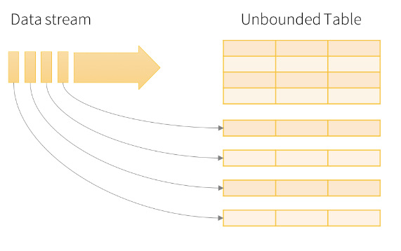

# Spark Structured Streaming

Sensors, IoT devices, social networks, and online transactions all generate data that needs to be monitored constantly and acted upon quickly. As a result, the need for large-scale, real-time stream processing is more evident than ever before. Apache Spark Structured Streaming is a near real-time processing engine that offers end-to-end fault tolerance with exactly-once processing guarantees using familiar Spark APIs. Structured Streaming lets you express computation on streaming data in the same way you express a batch computation on static data. The Structured Streaming engine performs the computation incrementally and continuously updates the result as streaming data arrives.

## Structure

In Structured Streaming, a data stream is treated as a table that is being continuously appended. This leads to a stream processing model that is very similar to a batch processing model. You express your streaming computation as a standard batch-like query as on a static table, but Spark runs it as an incremental query on the unbounded input table.

Consider the input data stream as the input table. Every data item that is arriving on the stream is like a new row being appended to the input table.

## Modes

A query on the input generates a result table. At every trigger interval (say, every 1 second), new rows are appended to the input table, which eventually updates the result table. Whenever the result table is updated, the changed result rows are written to an external sink. The output is defined as what gets written to external storage. The output can be configured in different modes:

- Complete Mode: The entire updated result table is written to external storage. It is up to the storage connector to decide how to handle the writing of the entire table.

- Append Mode: Only new rows appended in the result table since the last trigger are written to external storage. This is applicable only for the queries where existing rows in the Result Table are not expected to change.

- Update Mode: Only the rows that were updated in the result table since the last trigger are written to external storage. This is different from Complete Mode in that Update Mode outputs only the rows that have changed since the last trigger. If the query doesn't contain aggregations, it is equivalent to Append mode.

## Read from a data stream

You can use Structured Streaming to incrementally ingest data from supported data sources. Common data sources include the following:

- Data files in cloud object storage.
- Message buses and queues. 
- Delta Lake. 

Each data source provides a number of options to specify how to load batches of data. During reader configuration, you might need to configure options to do the following:

- Specify the data source or format (for example, file type, delimiters, and schema).
- Configure access to source systems (for example, port settings and credentials).
- Specify where to start in a stream (for example, Kafka offsets or reading all existing files).
- Control how much data is processed in each batch (for example, max offsets, files, or bytes per batch). See Configure Structured Streaming batch size on Databricks.

## Write to a data sink

A data sink is the target of a streaming write operation. Common sinks used in Databricks streaming workloads include the following:

- Delta Lake
- Message buses and queues
- Key-value databases

As with data sources, most data sinks provide a number of options to control how data is written to the target system. During writer configuration, you specify the following options:

- Output mode (append by default). 
- A checkpoint location (required for each writer). 
- Trigger intervals. 
- Options that specify the data sink or format (for example, file type, delimiters, and schema).
- Options that configure access to target systems (for example, port settings and credentials).

*Reference: https://docs.databricks.com/aws/en/structured-streaming/concepts*