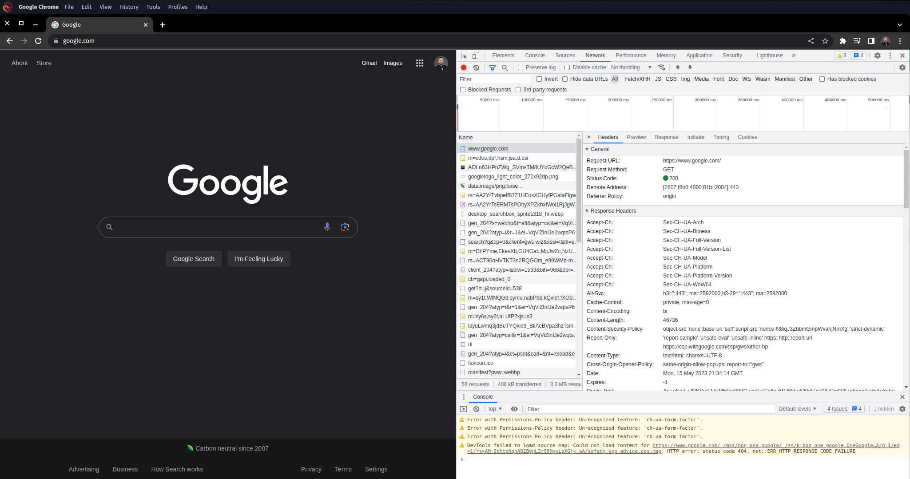
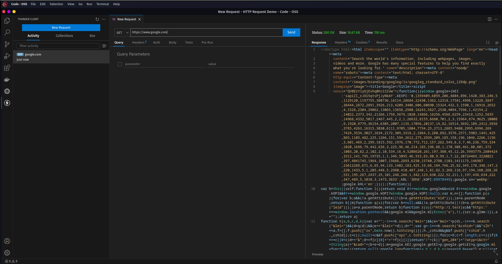
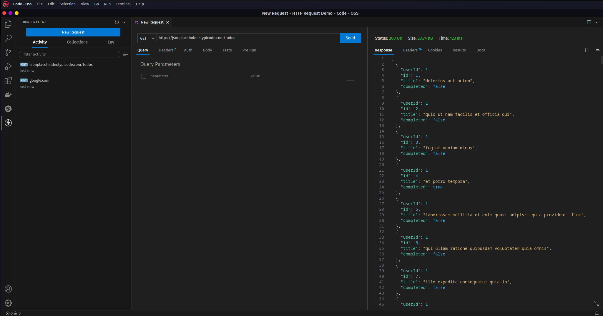
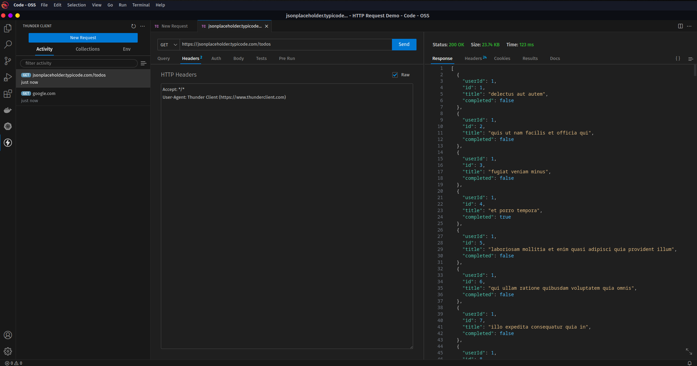
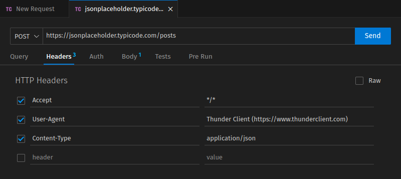
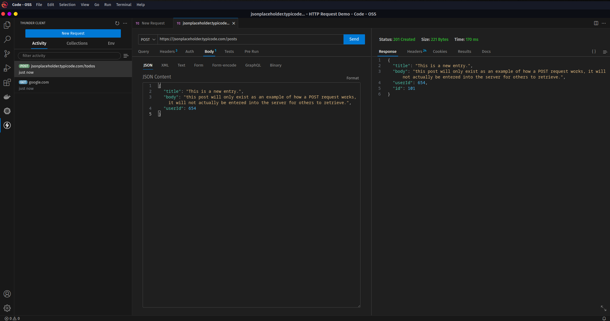

# REST - HTTP Request Demo


## 1. The most common example...

The most common example of an HTTP request is simply navigating to a website. Every navigation request to a new site is a HTTP GET request being generated by your web browser. We can examine and monitor this using the developer tools built into most browsers. Generally found under the setting or more tools option (in Chrome, menu -> more tools -> developer tools), and locating the network or traffic monitor.

With the network monitor open, enter a URl in your browsers navigation bar. It can be shorthand, like `google.com`, or verbose like `https://www.google.com`

After entering a URL, review the log in the network monitor. If your browser was successfully able to navigate to the URL you entered, you should see a GET request with a 200 status code.




## 2. HTTP Request Tools
Utilities designed to place HTTP requests are commonly used when building an API, and can be standalone programs (like Postman) or extensions for IDEs (like ThunderClient for VS Code). In either environment a request can be manually constructed and sent, and a response recieved and displayed.

As seen in the last step, a website that is loaded and displayed in a browser is just responding to an HTTP request. To gain familiarity with the utility placing the request, start with a simple GET request to an address that is easily confirmed to be working by navigating to it in a browser (like www.google.com).



In this example, the history of requests is available on the left, the current request is in teh center, and the result from the request is displayed on the right. Examinine the response from the request shows that the result is recognizable as an HTML docuemnt with inline JavaScript and CSS components.

This returned data would be interpreted by the browser to display the site.


## 3. HTTP Request Structure
Create a new GET request and enter the URL `https://jsonplaceholder.typicode.com/todos`

JSONPlaceholder is a free API designed to accept any type of HTTP request and give a valid responses. This allows developers to make a DELETE request, and recieve a response as if the data had been deleted, but no changes will be made to the server.



Notice that the response to this new GET request is data in JSON format.

HTTP messages all follow the same structure and have three main components: a start-line, headers, and a body. A GET request is generally the one of the simplest requests as it does not require a body, only a start-line and headers. This is common for requests that do not need to provide the server with data, and are only requesting data from the server (like GET, HEADERS, and DELETE).

The start-line of a request is a space separated list that includes three pieces of information: the type of request, the URI (or address) for the request, and the version of HTTP. The start-line of the request just placed looks like this:
`GET https://jsonplaceholder.typicode.com/todos HTTP/1.1`

Following the start-line (on the very next line of the request) is the HTTP headers. HTTP headers are single-line entries that begin with the header name followed by a colon, then the value of the header. Again the utility used to help generate and place the HTTP request is abstracting this from us, but we can view the headers in ThunderClient in a raw format by selecting the "headers" tab, and checking the "raw" check-box on the right. The key-value entry screen will change to a text field where headers can be manually edited.



The body of a request is separated from the headers by an empty line, and can be in one of several formats. As mentioned before, GET requests do not need a body, as they do not provide any information to the server.

- Create a new request, setting the type to POST, and the address to https://jsonplaceholder.typicode.com/posts
- On the headers tab, create a new entry with the header "Content-Type" and the value "application/json"
- On the body tab, select the JSON format from teh options at the top of the page, and enter the following content in the body field:
```
{
  "title": "This is a new entry.",
  "body": "this post will only exist as an example of how a POST request works, it will not actually be entered into the server for others to retrieve.",
  "userId": 654
}
```
- Send the request, and examine the response. Notice the status code, as well as the response content.





## 4. URI, URL, and Host

The address of a resource available online is formatted as a URI, or Universal Resource Identifier. URIs can use either a name or a location to identifiy a specific resource. URIs have a broader range of formats available, but most commonly developers will interact with URLs (Universal Resource Locators). URLs are a subset or URIs, but is mainly used for addressing web pages and resources.

If we examine a URL:

`https://jsonplaceholder.typicode.com/todos/1`

we can break the URL into component parts, such as:

- The protocol: `https`
- The host: `jsonplaceholder.typicode.com`
- The resource location: `todos`
- The resource identifier: `1`


## 5. Request Specific Resources

Commonly there is a specific resource that is required. Rather than requesting all results of that type and then filtering on the client, many servers will allow a request for a specific resource by including an identifier in the URI.

Place GET requests to the following two URIs, and compare the results:

- https://jsonplaceholder.typicode.com/posts
- https://jsonplaceholder.typicode.com/posts/15

Occasionally, the identifier for a resource is unknown, or a less specific filter is required. In these circumstances, so long as the filter does not need to be secret, the criteria can be included as request parameters.

- Create a GET request for `https://jsonplaceholder.typicode.com/posts`
- In the Query tab, create a new entry with the parameter "userId" and the value "3".
- Notice the change to the URI, which will now include the query parameter and value, and should now read: `https://jsonplaceholder.typicode.com/posts?userId=3`
- Send the request, and examine the response data.


